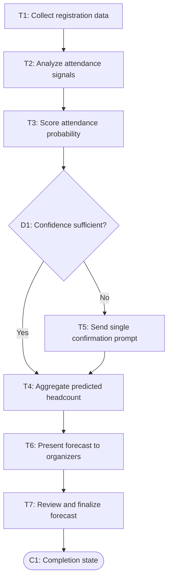

# Workflow of Tasks

*Replace all bracketed prompts with information specific to your proposed system. Delete instructional text that does not belong in your final specification. Add or remove task sections as needed. Every task shown in the general workflow must have a corresponding task specification below.*

## 1. Workflow Overview
### 1.1 Workflow Goal
This workflow supports the system goal defined in `my_first_agent/README.md`.

### 1.2 Workflow Trigger

HackTrack runs automatically at scheduled countdown checkpoints before the event (e.g., 7 days, 3 days, and 1 day out), once event registration is open.

### 1.3 Completion Condition at Runtime

A run is complete once HackTrack has produced an updated attendance-probability score for each registrant and an aggregated predicted headcount, and that forecast has been presented to CPVC organizers for review.

### 1.4 General Workflow

On the normal path, HackTrack collects current registration and RSVP-status data (T1: Collect registration data), then analyzes attendance signals such as time since registration, whether the registrant confirmed or updated their RSVP, and available past-event attendance patterns (T2: Analyze attendance signals). It scores each registrant's likelihood of attending (T3: Score attendance probability) and checks whether that score is confident enough (D1: Confidence sufficient?). If yes, the registrant is added directly to the aggregated headcount (T4: Aggregate predicted headcount). If not, HackTrack flags the registrant for a single, low-friction confirmation prompt rather than repeated outreach (T5: Send single confirmation prompt), keeping communication minimal, then that result also feeds into T4. Once all registrants are scored, HackTrack presents the aggregated forecast to CPVC organizers (T6: Present forecast to organizers), who review and finalize it to guide food, drink, and swag orders (T7: Review and finalize forecast). The run ends once a reviewed forecast has been produced.

### 1.5 Workflow Diagram

