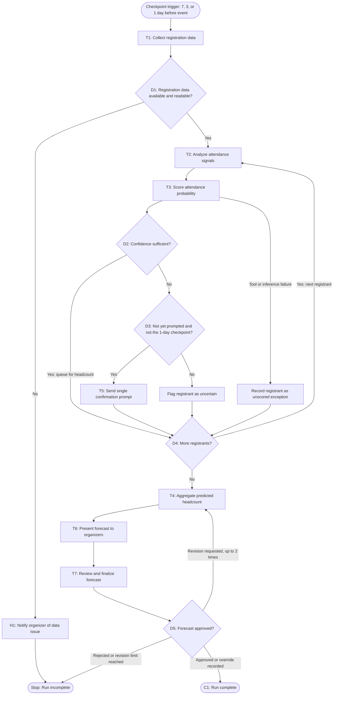

# Workflow of Tasks

## 1. Workflow Overview

### 1.1 Workflow Goal

This workflow supports the system goal defined in `my_first_agent/README.md`.

### 1.2 Workflow Trigger

HackTrack runs automatically at three scheduled countdown checkpoints once registration for the CPVC AI Hackathon is open: 7 days, 3 days, and 1 day before the event. Only one run may be active at a time; a trigger that arrives during an active run is logged as skipped rather than queued or duplicated.

### 1.3 Completion Condition at Runtime

A run is complete when every registrant on the current list has either a saved attendance-probability score or a recorded "unscored" exception, the predicted headcount and its low–high range have been calculated, and the CPVC event lead organizer has approved the forecast or recorded an override with a reason. If registration data cannot be loaded, or the organizer rejects the forecast or the revision limit is reached, the run ends as incomplete and is not reported as a finished forecast.

### 1.4 General Workflow

At each checkpoint, HackTrack collects the current registration list, RSVP statuses, the confirmation-prompt log, and CPVC's aggregated past-event attendance rates (T1: Collect registration data). It then checks whether that data is available and readable (D1). If not, it notifies the organizer of the data issue (H1: Notify organizer of data issue) and stops without producing a forecast.

If the data is usable, HackTrack works through registrants one at a time. For each registrant, it analyzes RSVP and timing signals, such as days since registration, whether the RSVP was confirmed or updated, and any prompt response, and assigns a signal group (T2: Analyze attendance signals). It then scores the registrant's attendance probability from the past-event rate for that group (T3: Score attendance probability) and checks whether the score is confident enough (D2). If yes, the registrant is queued for the headcount. If not, HackTrack checks whether the registrant has not yet been prompted and this is not the final 1-day checkpoint (D3). If both are true, it sends one low-friction confirmation prompt (T5: Send single confirmation prompt) and logs it so no registrant is ever prompted twice; the response is used at the next checkpoint. Otherwise, the registrant is flagged as uncertain. In both cases, the registrant is counted at their current probability. If T3 fails because of a tool or inference error, the registrant is recorded as an unscored exception and counted separately, never as zero. HackTrack repeats this loop until no registrants remain (D4).

Once all registrants are processed, HackTrack aggregates the expected headcount, a low–high range, and the number of uncertain and unscored registrants (T4: Aggregate predicted headcount), then presents the forecast with its evidence to CPVC organizers (T6: Present forecast to organizers). The CPVC event lead organizer reviews it (T7: Review and finalize forecast) and decides whether to approve it (D5). An approved forecast, or an override with a recorded reason, completes the run and guides food, drink, and swag orders. If the organizer requests a revision, such as a different walk-in buffer, HackTrack recalculates the forecast in T4 and presents it again, up to two times. A rejected forecast or a third revision request ends the run as incomplete.

After the event, organizers record the actual check-in count so that forecast error can be compared with the 10-percentage-point target in the system goal.

### 1.5 Workflow Diagram

```mermaid
flowchart TD
    S0([Checkpoint trigger: 7, 3, or 1 day before event]) --> T1[T1: Collect registration data]
    T1 --> D1{D1: Registration data available and readable?}
    D1 -->|No| H1[H1: Notify organizer of data issue]
    H1 --> E1([Stop: Run incomplete])
    D1 -->|Yes| T2[T2: Analyze attendance signals]
    T2 --> T3[T3: Score attendance probability]
    T3 -->|Tool or inference failure| X1[Record registrant as unscored exception]
    T3 --> D2{D2: Confidence sufficient?}
    D2 -->|Yes: queue for headcount| D4{D4: More registrants?}
    D2 -->|No| D3{D3: Not yet prompted and not the 1-day checkpoint?}
    D3 -->|Yes| T5[T5: Send single confirmation prompt]
    D3 -->|No| F1[Flag registrant as uncertain]
    T5 --> D4
    F1 --> D4
    X1 --> D4
    D4 -->|Yes: next registrant| T2
    D4 -->|No| T4[T4: Aggregate predicted headcount]
    T4 --> T6[T6: Present forecast to organizers]
    T6 --> T7[T7: Review and finalize forecast]
    T7 --> D5{D5: Forecast approved?}
    D5 -->|Approved or override recorded| C1([C1: Run complete])
    D5 -->|Revision requested, up to 2 times| T4
    D5 -->|Rejected or revision limit reached| E1
```
