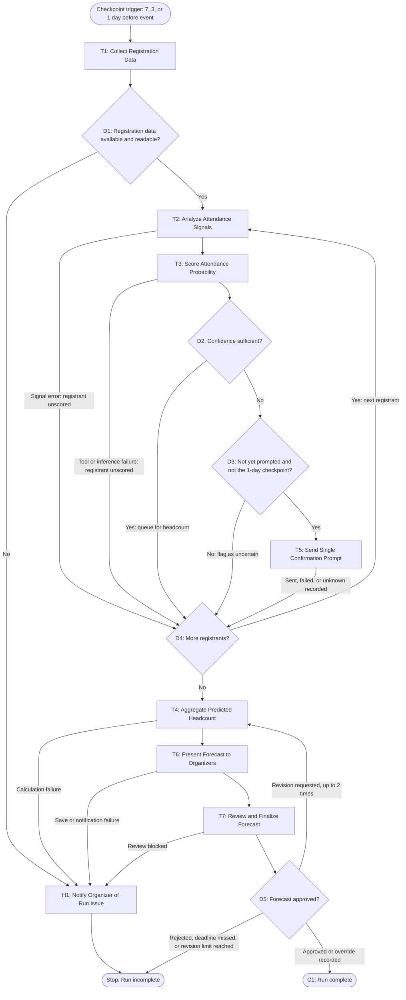

# Workflow of Tasks

## 1. Workflow Overview

### 1.1 Workflow Goal

This workflow supports the system goal defined in `my_first_agent/README.md`.

### 1.2 Workflow Trigger

HackTrack runs automatically at three scheduled countdown checkpoints once registration for the CPVC AI Hackathon is open: 7 days, 3 days, and 1 day before the event. Only one run may be active at a time. A trigger that arrives during an active run is logged as skipped rather than queued or duplicated.

### 1.3 Completion Condition at Runtime

A run is complete when three conditions are met:

- Every registrant on the current list has either a saved attendance-probability score or a recorded "unscored" exception.
- The predicted headcount and its low–high range have been calculated.
- The CPVC event lead organizer has approved the forecast or recorded an override with a reason.

The run ends as incomplete, and is not reported as a finished forecast, in any of these cases:

- Registration data cannot be loaded.
- A calculation, save, or review step fails.
- The organizer rejects the forecast.
- The organizer misses the review deadline.
- The organizer requests a third revision.

### 1.4 General Workflow

At each checkpoint, HackTrack first collects the current registration list, RSVP statuses, the confirmation-prompt log, and CPVC's aggregated past-event attendance rates, replacing names and emails with pseudonymous IDs (T1: Collect Registration Data). It then checks whether that data is available and readable (D1). If not, it alerts the event lead organizer (H1: Notify Organizer of Run Issue) and stops without producing a forecast.

If the data is usable, HackTrack works through registrants one at a time:

1. **T2: Analyze Attendance Signals** assigns each registrant to one signal group using fixed rules. If a required field is missing, the registrant is recorded as unscored and the loop moves on.
2. **T3: Score Attendance Probability** scores the registrant using the past-event rate for that group. If a tool or model call fails, the registrant is recorded as unscored and counted separately, never as zero.
3. **D2** checks whether the score's confidence is sufficient. If yes, the registrant is queued for the headcount.
4. If confidence is insufficient, **D3** checks whether the registrant has not yet been prompted and this is not the final 1-day checkpoint.
   - If both are true, **T5: Send Single Confirmation Prompt** sends one fixed message and logs it so no one is prompted twice. The registrant's RSVP update is picked up at the next checkpoint.
   - Otherwise, the registrant is flagged as uncertain.
   - Either way, the registrant is counted at their current probability.
5. **D4** repeats the loop until no registrants remain.

Once all registrants are processed:

1. **T4: Aggregate Predicted Headcount** calculates the expected headcount, a low–high range, and the numbers of uncertain, unscored, and prompted registrants.
2. **T6: Present Forecast to Organizers** saves and verifies the forecast, shows it with its evidence on the review page, and notifies the event lead. A failure in T4 or T6 goes to H1, and the run ends incomplete.
3. The event lead reviews it within 24 hours (**T7: Review and Finalize Forecast**) and decides at **D5**:
   - An approved forecast, or an override with a recorded reason, completes the run and guides food, drink, and swag orders.
   - A revision request, such as a walk-in buffer, sends the forecast back to T4 and then T6, up to two times.
   - A rejection, a missed deadline, or a third revision request ends the run as incomplete. A missed deadline is also escalated to the CPVC club president, and the last approved forecast from an earlier checkpoint stays in effect.

After the event, organizers record the actual check-in count so that forecast error can be compared with the 10-percentage-point target in the system goal.

### 1.5 Workflow Diagram

```mermaid
flowchart TD
    S0([Checkpoint trigger: 7, 3, or 1 day before event]) --> T1[T1: Collect Registration Data]
    T1 --> D1{D1: Registration data available and readable?}
    D1 -->|No| H1[H1: Notify Organizer of Run Issue]
    H1 --> E1([Stop: Run incomplete])
    D1 -->|Yes| T2[T2: Analyze Attendance Signals]
    T2 -->|Signal error: registrant unscored| D4{D4: More registrants?}
    T2 --> T3[T3: Score Attendance Probability]
    T3 -->|Tool or inference failure: registrant unscored| D4
    T3 --> D2{D2: Confidence sufficient?}
    D2 -->|Yes: queue for headcount| D4
    D2 -->|No| D3{D3: Not yet prompted and not the 1-day checkpoint?}
    D3 -->|Yes| T5[T5: Send Single Confirmation Prompt]
    D3 -->|No: flag as uncertain| D4
    T5 -->|Sent, failed, or unknown recorded| D4
    D4 -->|Yes: next registrant| T2
    D4 -->|No| T4[T4: Aggregate Predicted Headcount]
    T4 -->|Calculation failure| H1
    T4 --> T6[T6: Present Forecast to Organizers]
    T6 -->|Save or notification failure| H1
    T6 --> T7[T7: Review and Finalize Forecast]
    T7 -->|Review blocked| H1
    T7 --> D5{D5: Forecast approved?}
    D5 -->|Approved or override recorded| C1([C1: Run complete])
    D5 -->|Revision requested, up to 2 times| T4
    D5 -->|Rejected, deadline missed, or revision limit reached| E1
```
